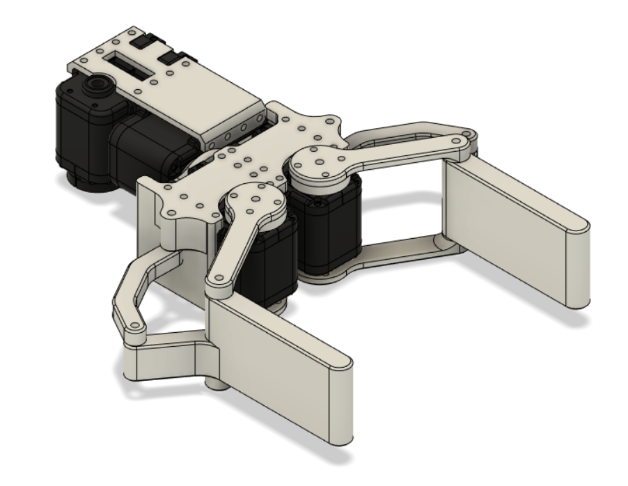
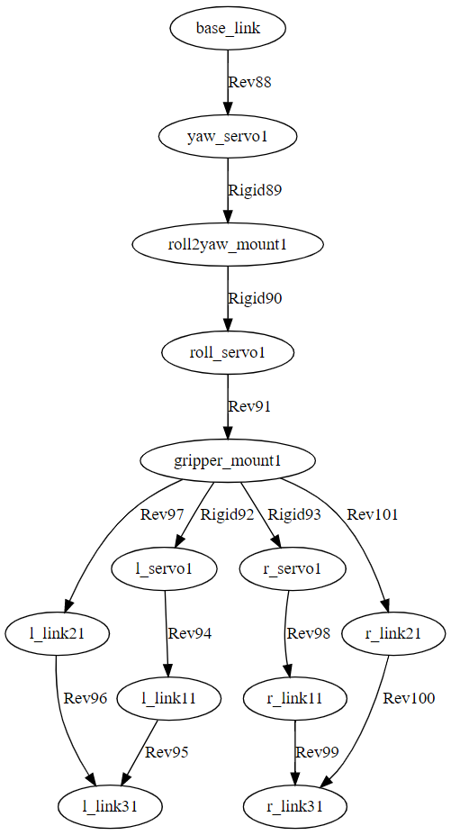

# CUR_Gripper
Cambridge University Robotics > Robocup Rescue > GripperV4

- URDF file produced using https://github.com/yanshil/Fusion2PyBullet
- Visualisation graphs produced using https://github.com/yanshil/Joint2Graphviz

The Fusion scripts from the above links are in the scripts folder for convenience.

# Hardware Overview
- 6 x ROBOTIS AX-12A actuators used for Gripper, Roll & Yaw Axis & Pitch Axis(?)
- 3D printed in PETG (STL files in assets)

Follows a common 4-bar linkage (parallelogram) mechanism for gripping action. The wrist axes are designed to be able to rotate a full 360 degrees (must ensure long enough wires are used !)

  

# URDF Layout

